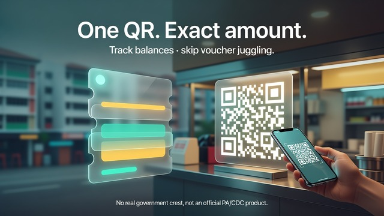
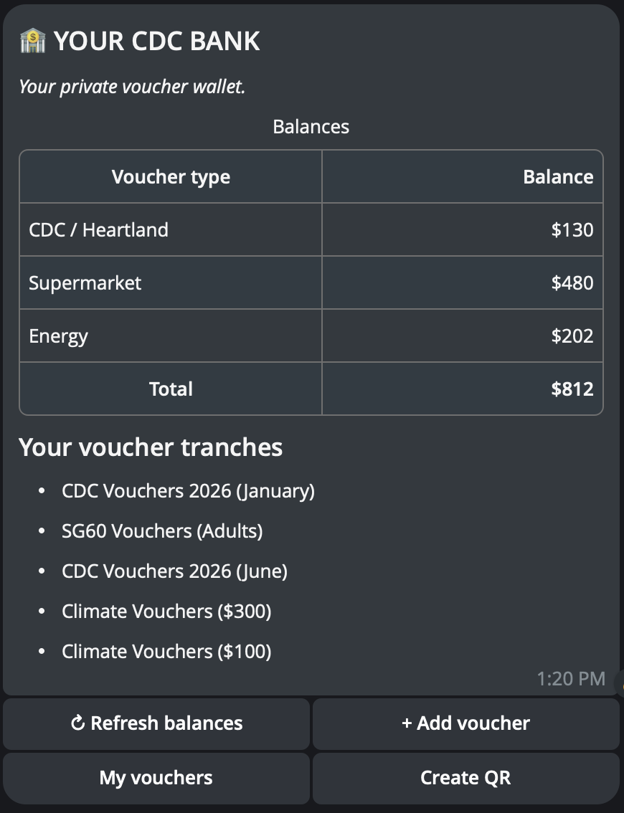
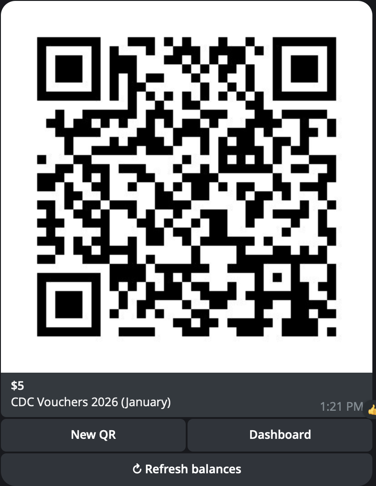

# CDC Voucher Bot

<p align="center">
  
</p>

<p align="center">
  <strong>Track CDC voucher balances · one QR for the exact amount at checkout</strong>
</p>

<p align="center">
  <a href="https://t.me/cdc_voucherbot"></a>
  <a href="https://github.com/ojassurana/cdc-voucher-bot/stargazers"></a>
  <a href="https://github.com/ojassurana/cdc-voucher-bot/blob/main/LICENSE"></a>
  <a href="https://deploy.workers.cloudflare.com/?url=https://github.com/ojassurana/cdc-voucher-bot"></a>
</p>

<p align="center">
  <a href="https://t.me/cdc_voucherbot"><strong>👉 Open the official bot: @cdc_voucherbot</strong></a>
</p>

A private Telegram quality-of-life bot for **CDC / Heartland**, **Supermarket**, and **Energy** vouchers.

Add a RedeemSG voucher link once → see live balances → generate a checkout QR for the amount you need.

<p align="center">
  
</p>

> **Unofficial community tool.** Not affiliated with, endorsed by, or operated by any government agency. Use at your own risk. Voucher links are sensitive — treat them like cash.

<p align="center">
  
  &nbsp;
  
</p>

---

## Try it

| | |
| --- | --- |
| **Official bot** | [**@cdc_voucherbot**](https://t.me/cdc_voucherbot) |
| **Direct link** | [https://t.me/cdc_voucherbot](https://t.me/cdc_voucherbot) |
| **Self-host** | Deploy your own Worker (below) |

---

## Features

- Rich Telegram dashboard with category totals and per-tranche balances
- Voucher links are **deleted after receipt** and **encrypted at rest** (AES-GCM)
- Duplicate detection without exposing the raw link
- Exact-amount QR when possible; otherwise largest safe amount + cash top-up hint
- Can split a payment across up to two tranches for a better exact match
- Per-user isolation in Cloudflare D1 (Telegram IDs are HMAC’d before storage)

### Commands

| Command | Purpose |
| --- | --- |
| `/start` or `/dashboard` | Open the CDC Bank dashboard |
| `/cdc` | Create a CDC / Heartland QR |
| `/supermarket` | Create a Supermarket QR |
| `/energy` | Create an Energy QR |

You can also use the inline buttons on the dashboard.

---

## Deploy your own

### 1. One-click deploy

[](https://deploy.workers.cloudflare.com/?url=https://github.com/ojassurana/cdc-voucher-bot)

After the deploy UI finishes:

1. Create a **D1** database named `cdc-voucher-wallet` (or any name you prefer).
2. Put that database’s **ID** into `wrangler.jsonc` under `d1_databases[0].database_id` (replace the sample ID from this repo).
3. Apply migrations (see below).
4. Set the four Worker secrets.
5. Point Telegram’s webhook at your Worker.

> The sample `database_id` in this repo belongs to a private instance. **Always use your own D1.**

### 2. Or deploy from the CLI

Requirements: Node 20+, a Cloudflare account, and [`wrangler`](https://developers.cloudflare.com/workers/wrangler/) auth (`npx wrangler login`).

```sh
git clone https://github.com/ojassurana/cdc-voucher-bot.git
cd cdc-voucher-bot
npm install

# Create D1 (once)
npx wrangler d1 create cdc-voucher-wallet
# → copy the database_id into wrangler.jsonc

# Apply schema
npx wrangler d1 migrations apply cdc-voucher-wallet --remote

# Deploy the Worker
npm run deploy
```

Your Worker URL will look like:

```text
https://cdc-voucher-bot.<your-subdomain>.workers.dev
```

Sanity check:

```sh
curl -sS https://cdc-voucher-bot.<your-subdomain>.workers.dev/health
# → {"ok":true,"service":"cdc-voucher-wallet","version":1}
```

---

## Create a Telegram bot

1. Open Telegram → talk to [**@BotFather**](https://t.me/BotFather)
2. Send `/newbot`
3. Pick a **display name** and a unique **username** ending in `bot`
4. Copy the **HTTP API token** BotFather gives you  
   (`123456789:AA...`) — this is `TELEGRAM_BOT_TOKEN`
5. Optional hygiene:
   - `/setjoingrouproups` → **Disable** (this bot is for private chats)
   - `/setprivacy` can stay default; the bot only needs messages you send it

That’s enough. No custom menu setup is required — `/start` registers the command menu for you.

Branding assets from this repo (optional):

| Asset | Path |
| --- | --- |
| Profile logo | [`docs/branding/logo.png`](docs/branding/logo.png) |
| Description picture (640×360) | [`docs/branding/description.jpg`](docs/branding/description.jpg) |

---

## Secrets

Generate strong random values, then set them on the Worker:

```sh
# Path secret in the webhook URL
openssl rand -hex 32          # → WEBHOOK_SECRET

# Telegram secret_token header
openssl rand -hex 32          # → TELEGRAM_SECRET_TOKEN

# 32-byte key for AES-GCM + HMAC (must be base64 of exactly 32 bytes)
openssl rand -base64 32       # → MASTER_ENCRYPTION_KEY
```

Set all four secrets (CLI):

```sh
npx wrangler secret put TELEGRAM_BOT_TOKEN
npx wrangler secret put TELEGRAM_SECRET_TOKEN
npx wrangler secret put WEBHOOK_SECRET
npx wrangler secret put MASTER_ENCRYPTION_KEY
```

Or set them in the Cloudflare dashboard: **Workers & Pages → cdc-voucher-bot → Settings → Variables and Secrets**.

| Secret | Role |
| --- | --- |
| `TELEGRAM_BOT_TOKEN` | BotFather HTTP API token |
| `TELEGRAM_SECRET_TOKEN` | Telegram `secret_token` (header check on every update) |
| `WEBHOOK_SECRET` | Random path segment: `/webhook/<WEBHOOK_SECRET>` |
| `MASTER_ENCRYPTION_KEY` | Base64 of 32 bytes — encrypts voucher URLs / group IDs and signs callbacks |

> **Rotate carefully.** Changing `MASTER_ENCRYPTION_KEY` makes previously encrypted rows unreadable. Changing webhook secrets requires re-running `setWebhook`.

---

## Connect Telegram → Worker

After deploy + secrets:

```sh
export BOT_TOKEN="…"           # from BotFather
export WEBHOOK_SECRET="…"      # same as Worker secret
export TELEGRAM_SECRET_TOKEN="…"
export WORKER_HOST="cdc-voucher-bot.<your-subdomain>.workers.dev"

curl -sS "https://api.telegram.org/bot${BOT_TOKEN}/setWebhook" \
  -H 'content-type: application/json' \
  -d "{
    \"url\": \"https://${WORKER_HOST}/webhook/${WEBHOOK_SECRET}\",
    \"secret_token\": \"${TELEGRAM_SECRET_TOKEN}\",
    \"allowed_updates\": [\"message\", \"callback_query\"],
    \"drop_pending_updates\": true
  }"
```

Verify:

```sh
curl -sS "https://api.telegram.org/bot${BOT_TOKEN}/getWebhookInfo"
```

You want `url` pointing at your Worker, `pending_update_count` low/zero, and no `last_error_message`.

---

## Using the bot

1. Open [**@cdc_voucherbot**](https://t.me/cdc_voucherbot) (or your self-hosted bot) → send `/start`
2. Tap **Add voucher**
3. Paste a RedeemSG link  
   (`https://voucher.redeem.gov.sg/...`)
4. The bot deletes that message, encrypts the link, and refreshes the dashboard
5. Pick a category (or use `/cdc`, `/supermarket`, `/energy`) and an amount
6. Scan the QR at a participating merchant checkout

Tips:

- One bot instance can serve many private users; each user’s data is isolated
- Re-adding the same tranche is rejected as a duplicate
- Keep the chat private — anyone with the bot *and* your voucher links could otherwise act on them if you paste links carelessly in shared chats

---

## Local development

```sh
npm install
cp .dev.vars.example .dev.vars
# fill the four secrets in .dev.vars

npx wrangler d1 migrations apply cdc-voucher-wallet --local
npm run dev
```

Checks:

```sh
npm run typecheck
npm test
```

---

## Privacy model (short)

| Data | Handling |
| --- | --- |
| Telegram user id | Stored only as HMAC-derived `user_key` |
| Voucher URL / group id | AES-GCM ciphertext in D1 |
| Duplicate detection | HMAC fingerprint, not plaintext |
| Incoming voucher messages | Deleted after intake |
| Logs / button payloads | No raw voucher links |

---

## Stack

- Cloudflare **Workers** + **D1**
- TypeScript
- QR rendering via `@cf-wasm/resvg` + Inter font
- RedeemSG **public** group lookup only (no merchant redeem API)

---

## License

MIT — see [`LICENSE`](LICENSE).

---

## Disclaimer

This project is an independent convenience wrapper around public RedeemSG recipient flows. It does **not** redeem vouchers on your behalf, store payment credentials, or claim any official status. You are responsible for your bot token, encryption key, and any voucher links you store.
